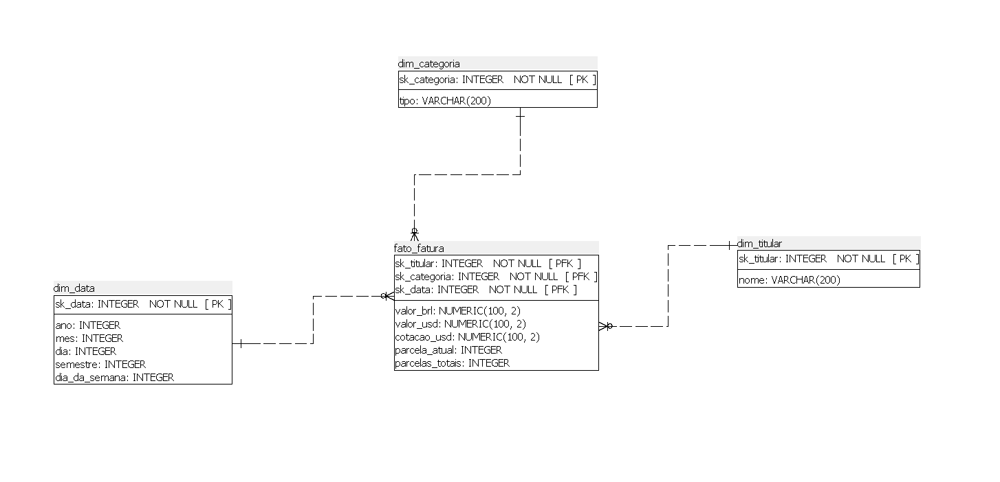

# Projeto BI: ETL e Data Warehouse de Faturas 📊💳

Este projeto consiste numa solução completa de *Business Intelligence* focada na extração, transformação e carga (ETL) de dados de faturas de cartões de crédito. O objetivo é transformar ficheiros CSV brutos num Data Warehouse relacional, permitindo análises detalhadas sobre gastos, categorias, titulares e datas.

## 🚀 Arquitetura e Modelagem de Dados

O projeto utiliza uma modelagem dimensional do tipo **Star Schema** (Modelo em Estrela), implementada numa base de dados PostgreSQL. O modelo é composto por:

### Tabela de Factos:
* **`fato_fatura`**: Armazena as métricas quantitativas (valor em BRL, valor em USD, cotação do dólar) e o controlo de parcelas (parcela atual e total).

### Tabelas de Dimensão:
* **`dim_titular`**: Contém a identificação dos donos dos cartões.
* **`dim_categoria`**: Classifica as despesas (ex: Restaurante, Automotivo, Saúde).
* **`dim_data`**: Permite a análise temporal detalhada (ano, mês, dia, semestre, dia da semana).



## 🛠️ Tecnologias Utilizadas

* **Python 3**: Linguagem principal para a lógica de ETL.
* **Pandas & NumPy**: Bibliotecas para limpeza, agregação e transformação de dados em memória.
* **Jupyter Notebook**: Ambiente de desenvolvimento interativo (`.ipynb`).
* **PostgreSQL**: Sistema de Gestão de Base de Dados Relacional utilizado para o Data Warehouse.
* **SQLAlchemy & Psycopg2**: Para a comunicação e inserção dos dados entre o Python e o PostgreSQL.
* **SQL Power Architect**: Ferramenta utilizada para o desenho da arquitetura de dados (`.architect`).

## 📁 Estrutura do Projeto

* `data/raw/`: Pasta onde os ficheiros originais (`.csv`) e o ficheiro consolidado devem ser armazenados.
* `modelagem.architect`: Ficheiro com o Diagrama Entidade-Relacionamento (DER) do projeto.
* `requirements.txt`: Ficheiro com todas as dependências Python necessárias para correr o projeto.
* `script.sql`: Script DDL para a criação das tabelas no PostgreSQL.
* `src/etl.ipynb`: Notebook Jupyter contendo todo o processo (pipeline) de ETL.

## ⚙️ Como Executar o Projeto

Siga os passos abaixo para replicar este projeto no seu ambiente local:

### 1. Pré-requisitos
* Ter o [Python](https://www.python.org/) e o [PostgreSQL](https://www.postgresql.org/) instalados.
* Ter criado uma base de dados no PostgreSQL chamada `DW_Faturas`.

### 2. Instalar as Dependências
Abra o terminal na pasta raiz do projeto e instale as bibliotecas necessárias:
```bash
pip install -r requirements.txt
```